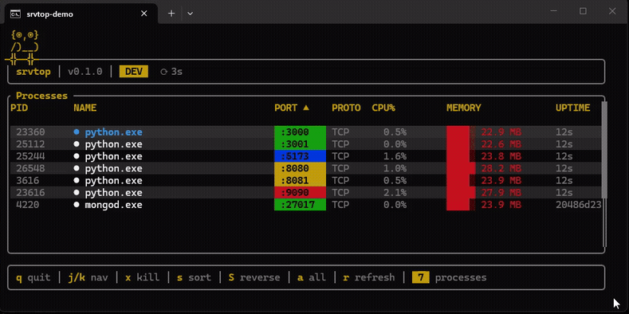

# srvtop

> Like `htop`, but for your dev servers.

Auto-discovers processes listening on localhost, shows live CPU/memory stats, and lets you kill them.
Cross-platform. Zero config.

<p align="center">
  
</p>

---

## Get started

```
cargo install srvtop
```

```bash
srvtop              # dev servers only
srvtop --all        # everything listening
srvtop -n 1         # 1s refresh
srvtop -p 3000      # single port
```

---

## Keybindings

`j` `k` navigate &nbsp;&middot;&nbsp; `x` kill &nbsp;&middot;&nbsp; `s` sort &nbsp;&middot;&nbsp; `S` reverse &nbsp;&middot;&nbsp; `a` toggle all &nbsp;&middot;&nbsp; `r` refresh &nbsp;&middot;&nbsp; `q` quit

---

## How it works

Scans TCP listeners via `listeners` crate &rarr; maps to PIDs &rarr; enriches with CPU/memory via `sysinfo` &rarr; filters to known dev tools and ports unless `--all`.

**Platforms** &mdash; Windows, macOS, Linux

**License** &mdash; MIT
